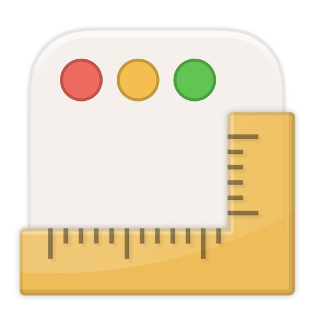

WindowAlignment
===============



A simple macOS application to align the active window by the keyboard
shortcut in the screen.

Usage
-----

Download the latest pre-build application binary from [Releases](https://github.com/niw/WindowAlignment/releases)
page or build it from the source code by following instruction.

Note that the pre-build application binary is only ad-hoc signed.
Therefore, you need to click Open Anyway to execute it on
Security & Privacy settings in System Settings.

The application is also need your approval to Accessibility access.
Follow the instruction appears on the dialog.


Configuration
-------------

Currently the application has no settings user interface.
Instead, it reads a configuration JSON file at `$XDG_CONFIG_HOME/window_alignment.json`,
where `$XDG_CONFIG_HOME` is default to `$HOME/.config`.
(If there is no such file, the app creates it with example configurations.)
The configuration file contains list of hot key (keyboard shortcut) and
alignment script.

To configure the behavior, manually change the configuration JSON
file and select Reload Configuration in the application menu.

This is an example configuration contains one alignment action that can
be triggered by `Shift` + `Command` + `Up` which align the active window
to the middle of screen.

```jsonc
{
  "actions" : [
    // Each action have "hot_key" and "move" and/or "resize" alignment scripts.
    {
      "hot_key" : {
        // Use macOS virtual key code used for Carbon API.
        "key_code" : 126,
        // Combination of "shift", "control", "option", or "command"
        "modifiers" : [
          "shift",
          "command"
        ]
      },
      // Alignment script to set window position. Optional.
      "move" : {
        "x" : "screen.x + screen.width * 0.125",
        "y" : "screen.y"
      },
      // Alignment script to set window size. Optional.
      "resize" : {
        "width" : "screen.width - (screen.width * 0.125) * 2",
        "height" : "screen.height"
      }
    }
  ]
}
```

### Alignment Script

The alignment script is a simple regular math syntax with following
variables.

|Name|Description|
|----|-----------|
|`screen.x`|Horizontal screen position.|
|`screen.y`|Vertical screen position.  |
|`screen.width` |Screen width.|
|`screen.height`|Screen height.|
|`window.x`|Horizontal window position.|
|`window.y`|Vertical window position.  |
|`window.width` |Window width.|
|`window.height`|Window height.|


Build
-----

You need to use the latest macOS and Xcode to build the app.
Open `Applications/WindowAlignment.xcodeproj` and build `WindowAlignment`
scheme for running.

If you have used another binary, next time when you launch the new binary,
it will shows an dialog to approve Accessibility access again.
However, often it doesn't work as expected for the new binary.
Therefore, use following command before launching the new binary to reset
Accessibility access.

```bash
tccutil reset Accessibility at.niw.WindowAlignment
```
